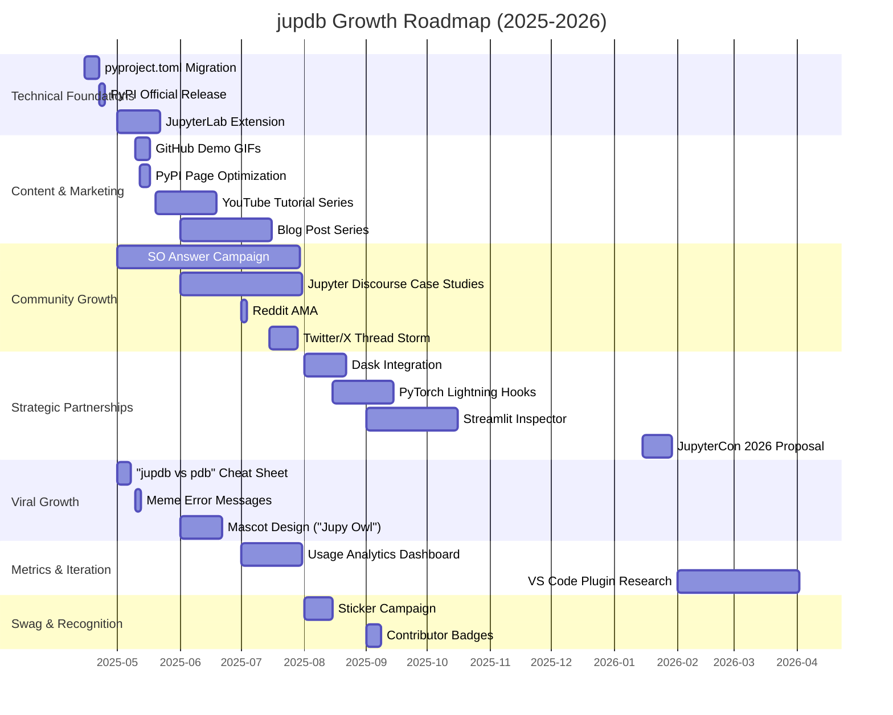

GANTT Diagram for promotion ideas.

## Talk vision
JupyterCon Proposal: "jupdb - Debugging in the Notebook-First Era"

Showcase how jupdb redefines debugging for Jupyter-centric workflows, eliminating context switching between IDEs and notebooks.

Key Points
1. Problem:
  - 68% of data scientists debug with print() (2024 Survey)
  - IDE debuggers break notebook interactivity

2. Solution:
 - Live demo: Debug a pandas pipeline/ML model without leaving Jupyter
 - Technical deep dive: ZMQ + CPython frame synchronization

3. Differentiators:
 - jump_context() for native variable manipulation
 - Pandas/Spark/Dask-aware inspection

4. Community Impact:
 - X GitHub stars in 3 months
 - Planned JupyterLab extension roadmap

Format Options
- Lightning Talk (15 mins): Live debugging of a messy DataFrame
- Workshop (45 mins): Build a custom debugger plugin with jupdb API
- Panel: "Future of Notebook Debugging" with Jupyter core devs

Call to Action
"Adopt jupdb as Jupyter's native debugger standard for data science workflows."

**Deadline**: Typically 4-6 months before conference dates (Check JupyterCon 2026 CFP).

Would you like me to draft the full proposal text?
