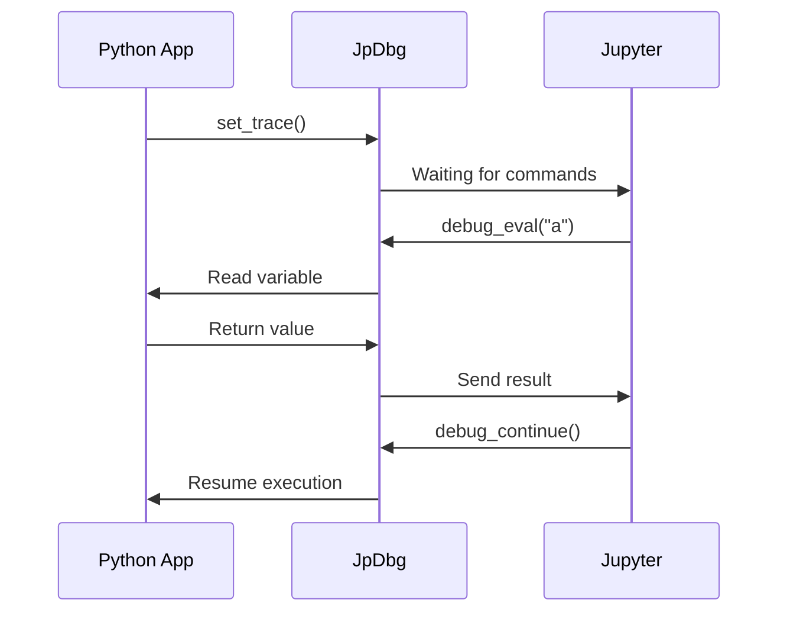
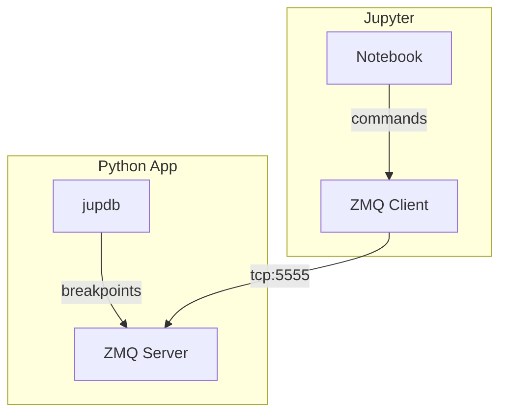
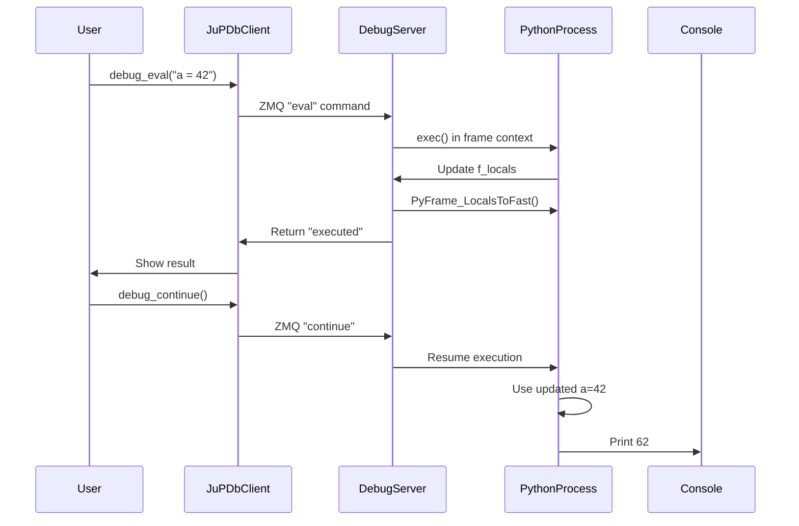

# jupdb - Jupyter Python Debugger
Jupyter-native debugging toolkit with real-time variable inspection &amp; modification

[](https://opensource.org/licenses/MIT)

Debug Python scripts directly from Jupyter with real-time context inspection.

## Features
- 🖥️ **Jupyter-native interface**
- 🔄 **Bi-directional variable sync**
- ⏯️ **Pause/resume execution**
- 📡 **ZeroMQ-based IPC**

## History
This project originated from a long-standing need I encountered while working with Python codes and Jupyter Notebooks. In February 2021, I asked on Stack Overflow:
["IPython REPL Anywhere: How to share application context with IPython console for debugging?"](https://stackoverflow.com/questions/66121284/ipython-repl-anywhere-how-to-share-application-context-with-ipython-console-for)

The Challenge:
- Debugging long-running data processing scripts (especially pandas workflows)
- Needing full access to variables/memory state without restarting processes
- Traditional `pdb/ipdb/web_pdb` being terminal-bound and Jupyter-incompatible
- Existing solutions requiring complex context managers or workflow changes

Why It Mattered:
- **Data Exploration**: Inspect DataFrames mid-processing without reloading data
- **Iterative Debugging**: Fix feature engineering pipelines live
- **Collaboration**: Share debug sessions with team members via notebooks
- **Complex Workflows**: Handle ML training loops and ETL processes

Jupdb is a take to solve this situation. By the way it developed with AI Deepseek recognition and provides a robust foundation for interactive debugging in Jupyter while maintaining Python execution integrity.
The key innovation was understanding and working with CPython's internal variable storage mechanism through PyFrame_LocalsToFast.

## Quick Start
```bash
# python -m pip install --upgrade setuptools wheel twine check-wheel-contents pip
pip install git+https://github.com/j0k/jupdb.git
```

```
jupdb/
├── src/
│   └── jupdb/
│       ├── __init__.py
│       ├── core.py
│       └── client.py
├── examples/
│   ├── demo.ipynb
│   └── app.py
├── setup.py
├── requirements.txt
├── LICENSE
└── README.md
```

## Install

```bash
git clone https://github.com/j0k/jupdb.git
cd jupdb
pip install .
```

## Usage

1. In Your Python Script (app.py)

```python
from jupdb.core import JuPDb

def example_function():
    a = 10
    jupdb = JuPDb()
    jupdb.set_trace()  # Breakpoint here
    b = 20
    print("Result:", a + b)

if __name__ == "__main__":
    example_function()
```

2. Start Debug Session
```bash
python app.py
```

3. In Jupyter Notebook
```python
from jupdb.client import debug_eval, debug_continue
print("Debug client ready!")

# Inspect variables
debug_eval("a")          # Returns {'result': '10'}

# Modify values
debug_eval("a = 42")     # Returns {'result': 'executed'}

# Continue execution
debug_continue()         # Returns {'status': 'resuming'} → app prints 62
```

## Architecture





Diagram for
```python
debug_eval("a")            # Returns {'result': '10'}
debug_eval("a = 42")       # Returns {'result': 'executed'}
debug_eval("a")            # Returns {'result': '42'}
debug_continue()
```


## Future Feature List:

### Feature 1: Jump to Context
(Direct Variable Access in Jupyter)

Seamlessly work with debug variables in Jupyter Notebook as if they were native:

```python
with jupdb.client.jump_context():  
    print(a)  # Access paused script's variables directly  
    a += 10   # Modify values in original context  
    df.plot()  # Interact with DataFrames/objects natively  
```
Key Benefits:

- 🚫 No More debug_eval("var") boilerplate
- 🔄 Auto-Sync: Changes propagate back to debugged script
- 🐼 Pandas-Friendly: Direct DataFrame manipulation
- 🔒 Isolated Scope: Variables cleanup post-context

Tech Basis:

- ZMQ-based frame introspection
- IPython namespace injection
- Deep copy for mutable objects
- Thread-safe synchronization

### Feature 2: Cross-Implementation Support:

```python
# Add PyPy compatibility
if 'PyPy' in sys.version:
    self.debug_frame.locals_to_fast()
else:
    # CPython sync code
```

### Feature 3: Enhanced Debugging Features:

- Breakpoint management
- Stack inspection
- Step-through execution
- Watch expressions

### Feature 4: Security:

```python
# Add ZMQ authentication
self.socket.curve_secretkey = b"..."
self.socket.curve_publickey = b"..."
```

### Feature 5: Error Handling:

```python
# Add timeout for ZMQ operations
self.socket.setsockopt(zmq.RCVTIMEO, 5000)
```

### Feature 6: Multi-Thread Support:

```python
# Use thread-safe queues
from queue import Queue
command_queue = Queue()
```

### Feature 7: User Interface:
```python
# Jupyter widget integration
from ipywidgets import interact
@interact
def debug_console(cmd=""):
    return debug_eval(cmd)
```

### Feature 8: Performance Optimization:

```python
# Use binary serialization instead of JSON
import pickle
socket.send(pickle.dumps(response))
```

### Feature 9: Version Compatibility:

```python
# Handle Python version differences
if sys.version_info >= (3, 11):
    frame = inspect.currentframe().f_back.f_back
else:
    frame = inspect.currentframe().f_back
```
