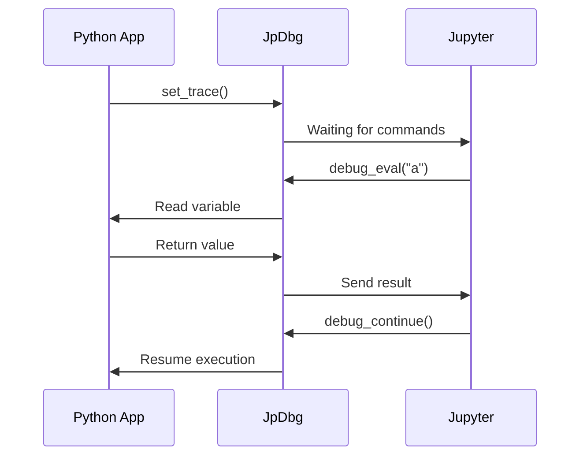
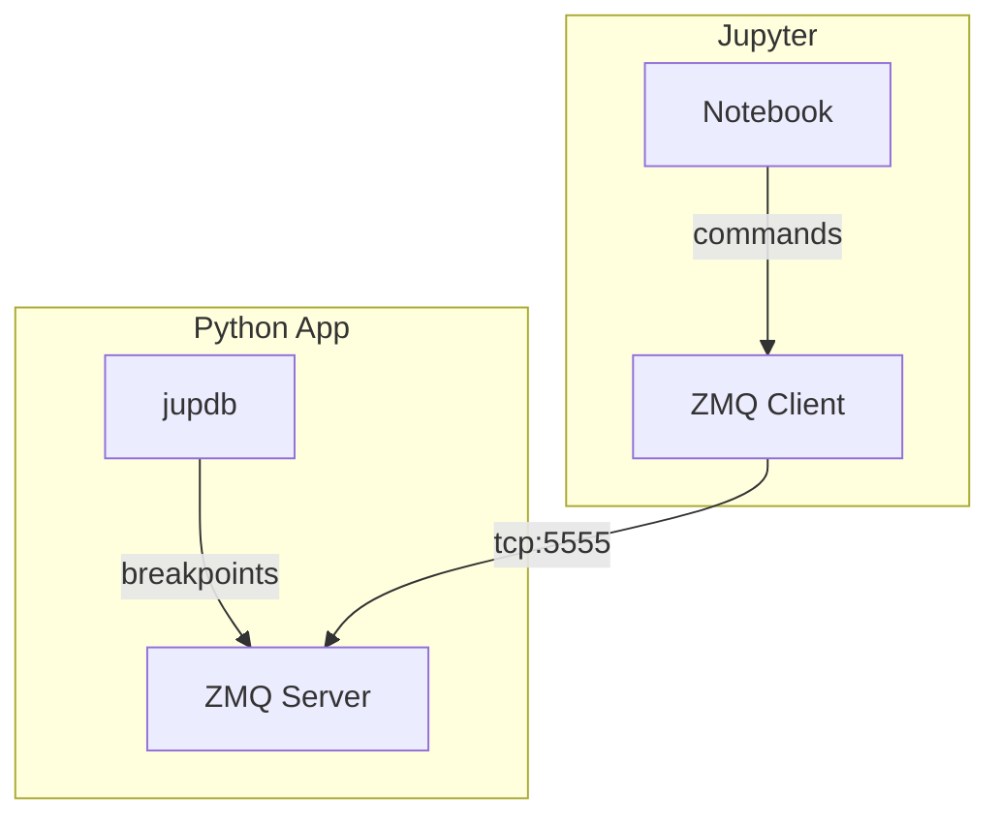

# jupdb - Jupyter Python Debugger
Jupyter-native debugging toolkit with real-time variable inspection &amp; modification

[](https://opensource.org/licenses/MIT)

Debug Python scripts directly from Jupyter with real-time context inspection.

## Features
- 🖥️ **Jupyter-native interface**
- 🔄 **Bi-directional variable sync**
- ⏯️ **Pause/resume execution**
- 📡 **ZeroMQ-based IPC**

## History
This project originated from a long-standing need I encountered while working with Python codes and Jupyter Notebooks. In February 2021, I asked on Stack Overflow:
["IPython REPL Anywhere: How to share application context with IPython console for debugging?"](https://stackoverflow.com/questions/66121284/ipython-repl-anywhere-how-to-share-application-context-with-ipython-console-for)

The Challenge:
- Debugging long-running data processing scripts (especially pandas workflows)
- Needing full access to variables/memory state without restarting processes
- Traditional `pdb/ipdb/web_pdb` being terminal-bound and Jupyter-incompatible
- Existing solutions requiring complex context managers or workflow changes

Why It Mattered:
- **Data Exploration**: Inspect DataFrames mid-processing without reloading data
- **Iterative Debugging**: Fix feature engineering pipelines live
- **Collaboration**: Share debug sessions with team members via notebooks
- **Complex Workflows**: Handle ML training loops and ETL processes

Jupdb is a take to solve this situation. By the way it developed with AI Deepseek recognition.

## Quick Start
```bash
pip install git+https://github.com/yourusername/jupdb.git
```

```
jupdb/
├── src/
│   └── jupdb/
│       ├── __init__.py
│       ├── core.py
│       └── client.py
├── examples/
│   ├── demo.ipynb
│   └── app.py
├── setup.py
├── requirements.txt
├── LICENSE
└── README.md
```

## Install

```bash
git clone https://github.com/j0k/jupdb.git
cd jupdb
pip install .
```

## Usage

1. In Your Python Script (app.py)

```python
from jupdb.core import JuPDb

def example_function():
    a = 10
    jupdb = JuPDb()
    jupdb.set_trace()  # Breakpoint here
    b = 20
    print("Result:", a + b)

if __name__ == "__main__":
    example_function()
```

2. Start Debug Session
```bash
python app.py
```

3. In Jupyter Notebook
```python
from jupdb.client import debug_eval, debug_continue
print("Debug client ready!")

# Inspect variables
debug_eval("a")          # Returns {'result': '10'}

# Modify values
debug_eval("a = 42")     # Returns {'result': 'executed'}

# Continue execution
debug_continue()         # Returns {'status': 'resuming'} → app prints 62
```

## Architecture





```
